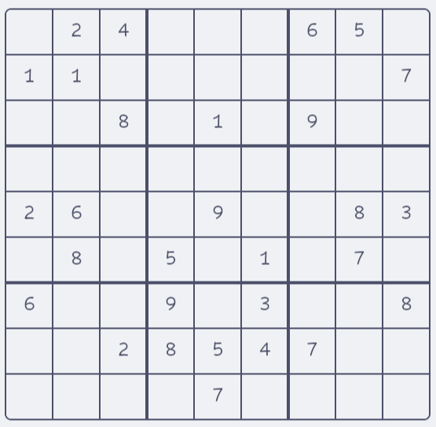
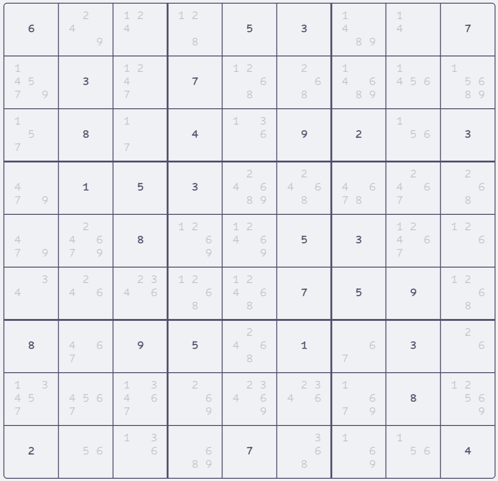

# Sudoku Solver
Requirements: C23
Optional requirement: ANSI escape codes (including "CSI s" and "CSI u", for grid printer to look nice)

## Approach
All basic strategies from [sudokuwiki.org](https://www.sudokuwiki.org/) have been implemented, the fast enough ones are used in combination with backtracking to solve all (possible) sudokus.

## Compilation
Use makefile or just compile all the .c files (C23 features are used!)

## Usage
```
Usage: ./main [INPUT [OUTPUT]]
       stdin and stdout are used by default

File format: One or more lines matching the following pattern: [0-9]{81}\n (0 denotes an unknown)
```

## Misc
gridPrinter.c may be interesting for others wanting to display a sudoku grid in the terminal, it supports two output formats:  
  
  
